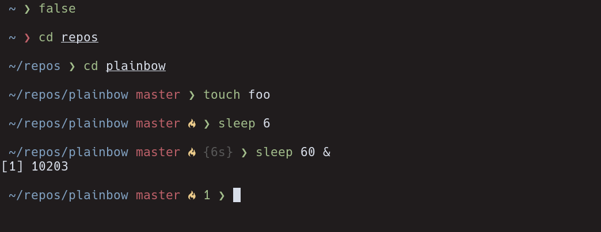

# Plainbow

> Pretty, minimal and fast rainbowish ZSH prompt




## Overview

Based on the [pure zsh prompt](https://github.com/sindresorhus/pure).


## Install

Requires Git 2.0.0+ and ZSH 5.2+. Older versions of ZSH are known to work, but they are **not** recommended.

### Manually

1. Either…
  - Clone this repo
  - add it as a submodule, or
  - just download [`plainbow.zsh`](plainbow.zsh) and [`async.zsh`](async.zsh)

2. Symlink `plainbow.zsh` to somewhere in [`$fpath`](https://www.refining-linux.org/archives/46-ZSH-Gem-12-Autoloading-functions.html) with the name `prompt_plainbow_setup`.

3. Symlink `async.zsh` in `$fpath` with the name `async`.

#### Example

```console
$ ln -s "$PWD/plainbow.zsh" /usr/local/share/zsh/site-functions/prompt_plainbow_setup
$ ln -s "$PWD/async.zsh" /usr/local/share/zsh/site-functions/async
```
*Run `echo $fpath` to see possible locations.*

For a user-specific installation (which would not require escalated privileges), simply add a directory to `$fpath` for that user:

```sh
# .zshenv or .zshrc
fpath=( "$HOME/.zfunctions" $fpath )
```

Then install the theme there:

```console
$ ln -s "$PWD/plainbow.zsh" "$HOME/.zfunctions/prompt_plainbow_setup"
$ ln -s "$PWD/async.zsh" "$HOME/.zfunctions/async"
```


## Getting started

Initialize the prompt system (if not so already) and choose `plainbow`:

```sh
# .zshrc
autoload -U promptinit; promptinit
prompt plainbow
```


## Options

| Option                               | Description                                                                                    | Default value  |
| :-------------------------------     | :--------------------------------------------------------------------------------------------- | :------------- |
| **`PLAINBOW_CMD_MAX_EXEC_TIME`**     | The max execution time of a process before its run time is shown when it exits.                | `5` seconds    |
| **`PLAINBOW_GIT_PULL`**              | Prevents Plainbow from checking whether the current Git remote has been updated.               | `0`            |
| **`PLAINBOW_GIT_UNTRACKED_DIRTY`**   | Do not include untracked files in dirtiness check. Mostly useful on large repos (like WebKit). | `0`            |
| **`PLAINBOW_GIT_DELAY_DIRTY_CHECK`** | Time in seconds to delay git dirty checking when `git status` takes > 5 seconds.               | `1800` seconds |
| **`PLAINBOW_PROMPT_SYMBOL`**         | Defines the prompt symbol.                                                                     | `❯`            |
| **`PLAINBOW_GIT_DOWN_ARROW`**        | Defines the git down arrow symbol.                                                             | `⇣`            |
| **`PLAINBOW_GIT_UP_ARROW`**          | Defines the git up arrow symbol.                                                               | `⇡`            |
| **`PLAINBOW_GIT_DIRTY_SYMBOL`**      | Defines the git dirty symbol.                                                                  | ` `           |
| **`PLAINBOW_BG_JOBS`**               | Display the number of jobs that have been put into background, if any.                         | `0`            |
| **`PLAINBOW_FULL_CWD`**              | Display the full current working directory                                                     | `1`            |

## Example

```sh
# .zshrc

autoload -U promptinit; promptinit

# optionally define some options
PLAINBOW_CMD_MAX_EXEC_TIME=10
PLAINBOW_BG_JOBS=1

prompt plainbow
```

## Integration

### [oh-my-zsh](https://github.com/robbyrussell/oh-my-zsh)

1. Set `ZSH_THEME=""` in your `.zshrc` to disable oh-my-zsh themes.
2. Follow the plainbow [Install](#install) instructions.
3. Do not enable the following (incompatible) plugins: `vi-mode`, `virtualenv`.

**NOTE:** `oh-my-zsh` overrides the prompt so plainbow must be activated *after* `source $ZSH/oh-my-zsh.sh`.

### [antigen](https://github.com/zsh-users/antigen)

Update your `.zshrc` file with the following two lines (order matters). Do not use the `antigen theme` function.

```sh
antigen bundle mafredri/zsh-async
antigen bundle martinohmann/plainbow
```

### [antibody](https://github.com/getantibody/antibody)

Update your `.zshrc` file with the following two lines (order matters):

```sh
antibody bundle mafredri/zsh-async
antibody bundle martinohmann/plainbow
```

### [zplug](https://github.com/zplug/zplug)

Update your `.zshrc` file with the following two lines:

```sh
zplug mafredri/zsh-async, from:github
zplug martinohmann/plainbow, use:plainbow.zsh, from:github, as:theme
```

### [zplugin](https://github.com/zdharma/zplugin)

Update your `.zshrc` file with the following two lines (order matters):

```sh
zplugin ice pick"async.zsh" src"plainbow.zsh"
zplugin light martinohmann/plainbow
```

## License

MIT © [Martin Ohmann](https://mohmann.de)
